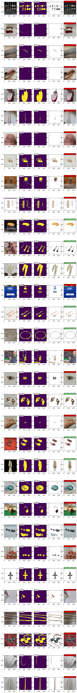

# Модель и её оценка

В этой секции обсуждается первая версия модели и ее оценка.

Базовое описание текущей задачи представлено в [README](../README.md).

==============================================

Ноутбук с подготовкой данных, обучением модели, анализом данных, представлен в [отдельном файле](jewellerysermentation.ipynb)

### **1. Создание датасета для обучения** 

Для создания обучающего датасета использовалась генерация картинок. 
В качестве основного объекта использовались изображения ювелирных украшений с прозрачным фоном (формат RGBA), взятые из открытых источников в интернете.
Общее число таких изображение было около 1.5к

В качестве фона использовалось одно из следующего:

- сгенерированный случайный размытый фон разного цвета;
- сгенерированный случайный размытый фон с нанесенными абстрактными фигурами различного цвета;
- изображения комнат с интерьером, открытый датасет https://www.kaggle.com/datasets/mikhailma/house-rooms-streets-image-dataset, подраздел house_data
- изображения рук , открытый датасет https://www.kaggle.com/datasets/glushko/rock-paper-scissors-dataset, 

### **2. Обучение модели**

Для сегментации данных использовалаись модель Unet на базе efficientnet-b3 (библиотека segmentation_models_pytorch)

`
model = segmentation_models_pytorch.Unet(encoder_name='efficientnet-b3', in_channels=3, classes=1, activation=None)
`

Функция ошибок

`nn.BCEWithLogitsLoss()`

Алгоритм оптимизации Adam

### **3. Результат обучения модели**

Анализ результатов проводился на основе датасета, предоставленный из Авито (неразмеченные картинки)

Анализ результатов показал, что визуально хороший результат только в том случае, когда сегментация прошла практически идеально.
Даже небольшие отклонения вызывают неприязнь.

Причем, чем сложнее фон, мельче украшение, тем менее вероятна успешная сегментация.

Следовательно, человеку необходимо показывать изображения только в том случае, если модель очень уверена в результате.

В качестве критериев принято следующее:

- маска занимает не менее 5% и не более 50% площади изображения
-  модель уверенна в результате на не менее 98%.

Под уверенностью моделью в данном случае понимается следующее:

1. высчитывается на сколько предсказание в каждом пикселе в маске близко 1 (иными словами, среднее значение предсказание в маске)
2. высчитывается на сколько предсказание в каждом пикселе вне маски (то есть фон) близко к 0 (иными словами, единица минус среднее значение предсказание вне маски)
3. из двух данных значений принимается наименьшее.

Таким образом, можно рекомендовать удалить фон согласно текущей модели примерно в трети случаев.

### **4. Пример сегментации модели**

    столбец 1 - анализируемое изображение    
    столбец 2 - маска, созданная моделью     
    столбец 3 - маска после удаления отдельных точек и тонких линий    
    столбец 4 - результат сегментации    
    столбец 5 - изображение, показываемое человеку

Зеленым отмечены картинки с удаленным фоном.
Красным отмечены картинки для которых качественно удалить фон не удалось.

