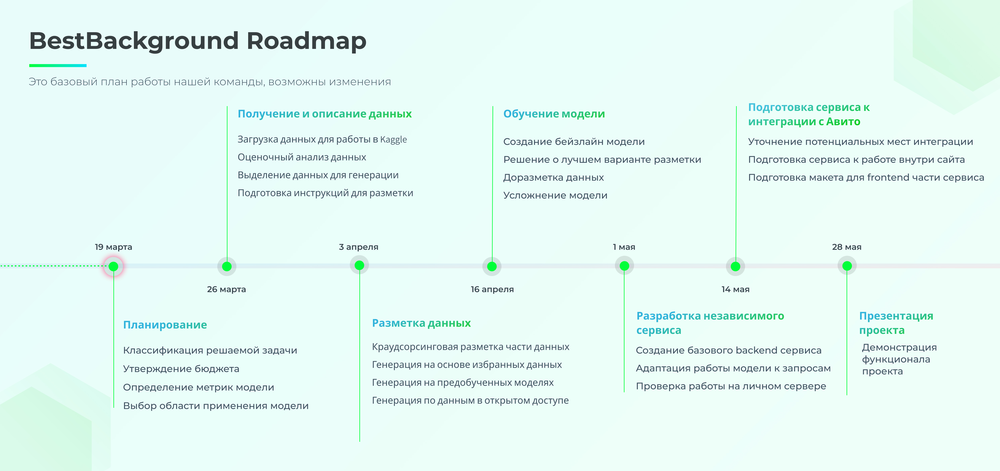

# Схема решения и метрики

В этой секции описывается первоначальный план решения задачи с последовательными этапами выполнения, базовый пример предполагаемого сервиса для пользователей, бизнес- и ML- метрики решаемой задачи.

### **Схема решения задачи.**

### **Решение с примером использования**

В качестве решения мы предполагаем сервис, который принимает изображение от пользователя и возвращает измененную картинку с выделенным и обрезанным главным объектом. Реализация этой процедуры планируется на этапе создания заявки.

Сервис в этом контексте представляет собой интерфейс для загрузки фотографии, который подает запрос на сервер с моделью бинарной сегментации. Решение этой модели в виде маски накладывается на изображение и вся незамаскированная область видоизменяется: фон замыливается, картинка обрезается по краям выделенной области.

Результирующая картинка отправляется пользователю, и он через интерфейс принимает решение о выборе в качестве изображения для товара модифицированного или изначального изображения. В последнем случае уточняется причина отказа: неверная сегментация или личное предпочтение пользователя. В первом случае информация сохраняется и может потенциально использоваться для дообучения модели.

### **Какая бизнес-метрика должна оптимизироваться? Какое её значение будет считаться успехом?**

В качестве бизнес-метрик мы предполагаем две отслеживаемые характеристики:

1. Отношение числа переходов на страницу товара к числу показов товара на основной странице просмотра объявлений.

Эта метрика позволит оценить прирост первичной заинтересованности покупателей в товаре после внедрения модели.

В качестве нулевого результата в этом случае принимаются показатели соответствующей метрики до применения модели, в качестве наилучшего результата - показатели соответствующей метрики для профессиональных продавцов, которые проводят аналогичную нашей модели обработку своих изображений самостоятельно (однотонный фон, фокусировка на объекте продажи, верная обрезка изображений).

2. Число отказов от использования модели по причине неверной сегментации.

Эта метрика характеризует качество решения задачи на этапе потоковой обработки изображений.

Хорошим результатом будет совпадение показателей с качеством решаемой задачи по выбранной нами ML-метрике, плохим результатом будет значительное, на уровне единиц процентов, отклонение пользовательского отзыва от нашей ML-метрики.

### **Какая метрика машинного обучения будет наилучшим образом отражать оптимизацию бизнес-метрики?**

В данном случае мы предполагаем использование в качестве ML-метрики значение Intersection over Union (IoU) для ответа модели и результата, полученного при разметке данных.
